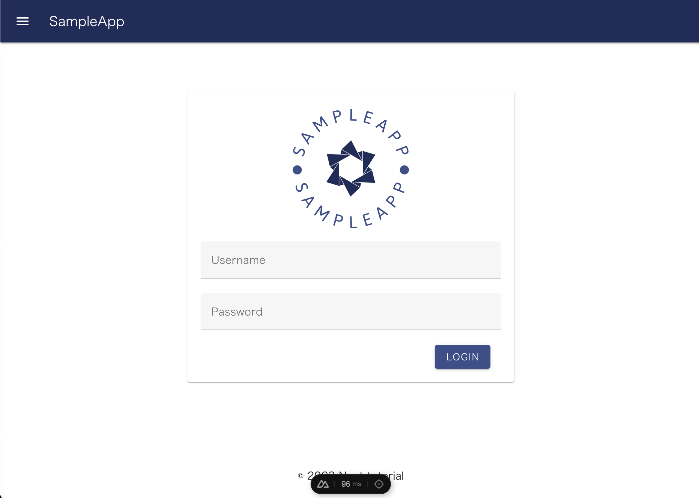

# Webアプリ作成チュートリアル

バックエンドにFastAPI、フロントエンドにNuxt3、データベースにMySQLを利用した、モダンなWebアプリのチュートリアルです。

※ `tutorial/` 配下にチャプターごとにディレクトリが切ってあります。

# 目次

- [Chapter1 FastAPI入門](tutorial/chapter1/README.md)
- [Chapter2 RDB入門](tutorial/chapter2/README.md)
- [Chapter2.5 SQLAlchemyを利用したデータベースの操作](tutorial/chapter2.5/README.md)
- [Chapter3 Alembicを利用したマイグレーションを実装してみよう](tutorial/chapter3/README.md)
- [Chapter4 FastAPIでCRUDを実装してみよう](tutorial/chapter4/README.md)
- [Chapter5 認証・認可が必要なAPIを実装してみよう](tutorial/chapter5/README.md)
- [Chapter6 APIテストを実装してみよう](tutorial/chapter6/README.md)
- [Chapter7 番外編1: JavaScriptのおさらい](tutorial/chapter7/README.md)
- [Chapter8 番外編2: TypeScriptのおさらい](tutorial/chapter8/README.md)
- [Chapter9 Nuxt.js入門](tutorial/chapter9/README.md)
- [Chapter10 ログインページの実装](tutorial/chapter10/README.md)
- [Chapter11 アイテム・ユーザー管理ページ(CRUD)の実装](tutorial/chapter11/README.md)

# 完成形

完成形を動かしてみましょう


```bash
# DB起動
./bin/mysql.sh
```

```bash
# 開発shellにログイン
./bin/run.sh chapter11 -m shell --sample

# DBの初期化
./bin/init-database.sh
```

```bash
# 開発shellにログイン
./bin/run.sh chapter11 -m shell --sample

# DBの初期化
./bin/init-database.sh

# 開発shellからログアウト
exit
```

```bash
# アプリの起動
./bin/run.sh chapter11 -m shell --sample
```

アプリが起動したら http://localhost:3000/ にアクセスしてみましょう。

下記。ユーザーでログイン可能です。

```
Username: sys_admin
Password: admin
```




# TODO
- chapter1
  - Request, Responseを利用した説明
- APIにバリデーションを追加
  - @field_validator
    - https://docs.pydantic.dev/latest/usage/validators/#field-validators
  - 注釈付きバリデータ
    - https://docs.pydantic.dev/latest/usage/validators/#annotated-validators
- chapter9
  - ライフサイクル
    https://ja.vuejs.org/guide/essentials/lifecycle.html#lifecycle-diagram
  - SSR
    https://nuxt.com/docs/guide/concepts/rendering